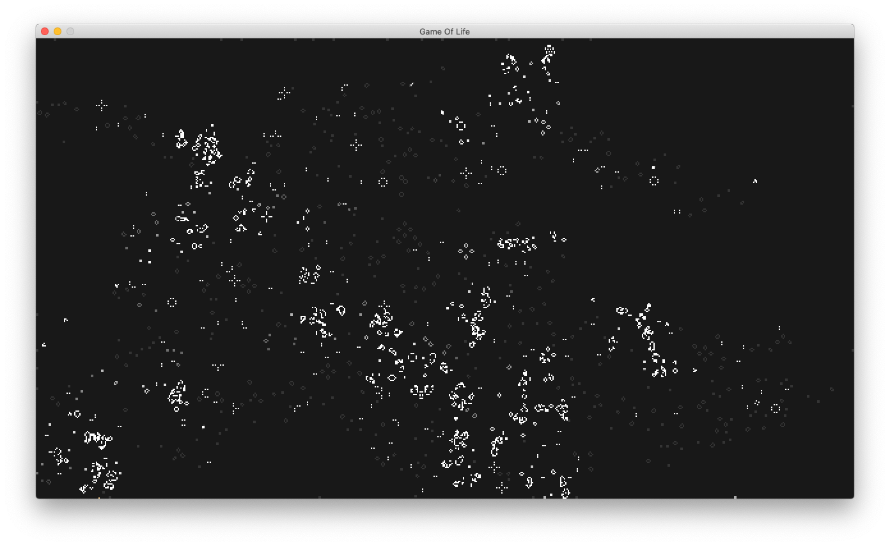

# Conway's Game Of Life

This is an implementation of [John Conway's Game Of Life](https://en.wikipedia.org/wiki/Conway%27s_Game_of_Life) in the Haskell programming language.

The generations are animated at 60 frames per second.

## Getting Started

**Prerequisites**

- [Stack](https://docs.haskellstack.org/en/stable/README/) was used to build this project.
- [SDL2](https://www.libsdl.org/) was used (via these [bindings](https://www.stackage.org/lts-14.27/package/sdl2-2.5.1.0)) for window management, input and rendering.

Run `stack build` to compile the source code.

To run the program from this directory, run `stack run`.

If you would like to install the binary into Stack's bin path, run `stack install`. The binary is called `gameoflife`.

## Input bindings

Click the **left mouse button** to place an "interesting" pattern where you clicked.

Click and drag the **right mouse button** to continuously place patterns as you drag the mouse.

Press **P** to pause and unpause the evolution of the generations.

Press **Escape** to quit.

> The "interesting" pattern was supposed to be a glider but a typo gave me something much more interesting.

